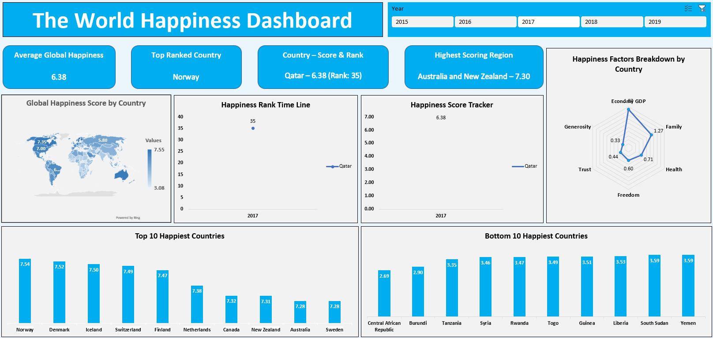

# World Happiness Dashboard

This interactive dashboard, built in Microsoft Excel, visualizes World Happiness data across multiple years. It provides insights into global happiness scores, country rankings, and key factors influencing well-being worldwide.

## 📊 Features

- Average Global Happiness Score
- Top Ranked Countries and their scores
- Global Happiness Map showing scores by country
- Happiness Rank Timeline for selected countries
- Happiness Score Tracker across years
- Radar Chart displaying happiness factors:
  - Economy (GDP)
  - Family
  - Health
  - Freedom
  - Trust
  - Generosity
- Top 10 Happiest Countries chart
- Bottom 10 Happiest Countries chart
- Year slicer for exploring trends (2015 – 2019)

## 🛠 Tools Used

- Microsoft Excel
- Data Visualization techniques
- Pivot tables and charts
- Interactive slicers

## 🌍 Data Source

- World Happiness Report

## 🖼 Screenshot

## 🚀 How to View

- Download the Excel file from this repository
- Open it in Microsoft Excel (2016 or newer recommended)
- Use slicers to explore different years and country comparisons

## 👤 Author

[Mohamed Aslam](https://github.com/Mohamed-Aslam-29)

